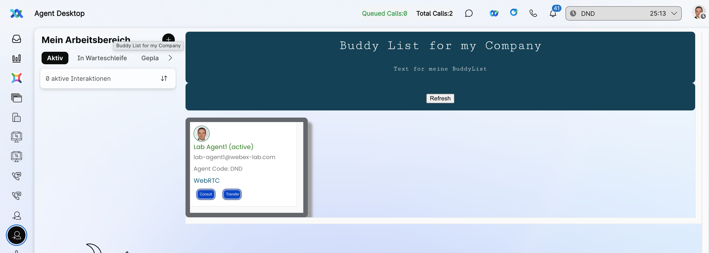

## Buddy List Widget Sample

## Developer Documentation

**https://developer.webex-cx.com/documentation/guides/desktop**

**Step 1:**

- Inside this project on your terminal type: `npm install`
- Then inside this project on your terminal type: `npm run dev`
- This should run the app on your localhost:5000

**Step 2:**

- In the **_buddy_list.js_** file, change the Outdial configuration based on your org under Desktop.dialer.startOutdial method.

**Step 3:**

_To wire up the Widget to the Layout:_

- Upload the **_addressbook-widget.json_** file onto your Administration Portal **[WebexCC Portal - US](https://portal.wxcc-us1.cisco.com/portal/home.html#)**
  - _link above is referencing the US portal link please change if you are in different geo (us1, eu1, eu2, anz1)_
  - Note that Layouts are configured per Agent Team.
- Log in to your agent and select the right Team to view the new layout.
